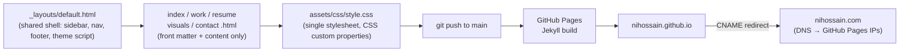

<div align="center">

# NIH — Naser Hossain

**Personal site & portfolio — source for [nihossain.com](https://nihossain.com)**


</div>

---

## What this is

This repo **is** [nihossain.com](https://nihossain.com) — a small static portfolio site for Naser Hossain (mechanical engineering leader / industrial design enthusiast / practical technologist). There's no build tooling beyond Jekyll: five HTML pages, one shared layout, one stylesheet. Push to `main` and GitHub Pages rebuilds and redeploys automatically.

```
you edit a page  →  git push  →  GitHub Pages runs Jekyll  →  live at nihossain.com
```

## Pages

| Page | File | What's there |
|---|---|---|
| **About** | [`index.html`](index.html) | Bio, three focus-area pillars (Engineering Leadership · Industrial Design · AI & Manufacturing), quick links to the other pages |
| **Work** | [`work.html`](work.html) | Selected projects, one entry per role |
| **Resume** | [`resume.html`](resume.html) | Experience / education timeline, competencies, certifications, patents |
| **Visuals** | [`visuals.html`](visuals.html) | Photography & short film |
| **Contact** | [`contact.html`](contact.html) | Email, phone, social links |

Navigation order is fixed in the sidebar (`_layouts/default.html`) as **About → Work → Resume → Visuals → Contact**, and the About page's bottom CTA row mirrors that same sequence.

## Design

The visual language is **borrowed from [gather.do](https://gather.do)**, hand-adapted into original HTML/CSS (no theme gem, no framework, no JS build step) — see the header comment in [`assets/css/style.css`](assets/css/style.css). The borrowed pieces:

- Fixed sidebar "app shell" layout, collapsing to a horizontal top bar on mobile
- Bold grotesk sans-serif type, hairline dividers, uppercase micro-labels
- Bordered pill buttons, minimal filled-geometric icons (■ ◆ ●) for the pillars
- A black hero block

**Dark mode is the default** on first load (`data-theme="dark"` in `_layouts/default.html`); a toggle in the sidebar lets visitors switch, and the choice is remembered via `localStorage`.

<table>
<tr><th align="left">Token</th><th align="left">Light</th><th align="left">Dark</th></tr>
<tr><td><code>--bg</code></td>
<td> <code>#ffffff</code></td>
<td> <code>#0a0a09</code></td></tr>
<tr><td><code>--text</code></td>
<td> <code>#141414</code></td>
<td> <code>#ededeb</code></td></tr>
<tr><td><code>--hairline</code></td>
<td> <code>#e6e6e4</code></td>
<td> <code>#262622</code></td></tr>
</table>

Social links (email / LinkedIn / Instagram / Facebook) render as small bordered monochrome SVG icon buttons in the footer, using `currentColor` so they adapt to whichever theme is active. The favicon is a self-contained "NIH" monogram (Courier New Bold on the site's dark badge colors) rendered to `favicon.ico` / PNG / apple-touch-icon — no external icon service.

## How it's served



Each page is just Jekyll front matter (`title`, `description`) plus a content fragment; `_config.yml` applies the `default` layout to every page, so the sidebar/nav/footer never need to be repeated. The `CNAME` file pins the custom domain — as long as it's present, GitHub Pages will always 301-redirect `nihossain.github.io` to `nihossain.com`, by design.

## Running locally

Requires Ruby + Jekyll (not bundled in this repo):

```bash
bundle exec jekyll serve
```

## Structure

```
.
├── _config.yml           # site metadata, Jekyll settings, default layout rule
├── _layouts/default.html # shared shell: <head>, sidebar, nav, footer, theme toggle
├── assets/css/style.css  # single stylesheet — all page/theme styling
├── index.html             # About
├── work.html               # Work
├── resume.html             # Resume
├── visuals.html            # Visuals
├── contact.html            # Contact
├── CNAME                  # custom domain pin (nihossain.com)
├── favicon.ico / *.png    # NIH monogram favicon set
└── apple-touch-icon.png   # iOS home-screen icon
```

## Download this theme

**[⬇ Download nih-theme.zip](https://raw.githubusercontent.com/nihossain/nihossain.github.io/main/nih-theme.zip)**

A self-contained copy of everything in this repo, plus an `INSTRUCTIONS.md` written for **Claude Code**: unzip it, point Claude Code at the folder, and it walks through creating your own `<username>.github.io` repo, personalizing every page, regenerating the favicon, and (optionally) wiring up a custom domain — the same process used to build and deploy this site.
